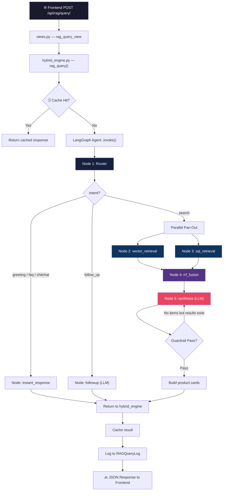
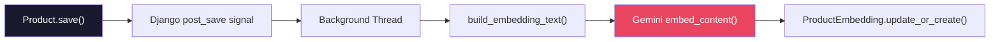
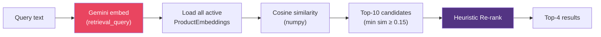
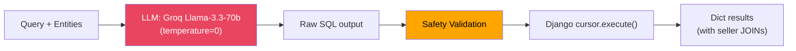
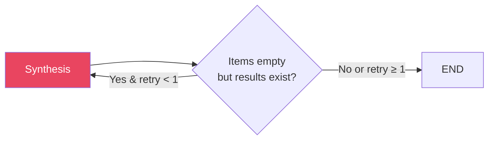

# RAG System — Full Flow Walkthrough

> [!NOTE]
> This documents the **V2 Architecture** — a 5-node LangGraph pipeline that replaced the original 11-node V1. It uses only **1 LLM call** (synthesis) instead of 3, and routes greetings/FAQ/chitchat with **zero tokens**.

---

## High-Level Architecture



---

## File Map

| Layer | File | Purpose |
|-------|------|---------|
| **API** | [urls.py](file:///d:/LAST_V/backend/rag/urls.py) | `POST /api/rag/query/` and `GET /api/rag/cache-stats/` |
| **API** | [views.py](file:///d:/LAST_V/backend/rag/views.py) | Django REST views — validation + error handling |
| **Engine** | [hybrid_engine.py](file:///d:/LAST_V/backend/rag/hybrid_engine.py) | Orchestrator — cache check → LangGraph → cache set → log |
| **Cache** | [response_cache.py](file:///d:/LAST_V/backend/rag/response_cache.py) | LRU cache (100 entries, 10 min TTL, Arabic-normalized keys) |
| **Graph** | [rag_graph.py](file:///d:/LAST_V/backend/rag/graph/rag_graph.py) | LangGraph `StateGraph` definition — 7 nodes, conditional edges |
| **Graph** | [state.py](file:///d:/LAST_V/backend/rag/graph/state.py) | `AgentState` TypedDict + Pydantic `SynthesisOutput` schema |
| **Graph** | [config.py](file:///d:/LAST_V/backend/rag/graph/config.py) | Groq key pool (round-robin 3 keys), LangSmith setup |
| **Node 1** | [nodes/intent_router.py](file:///d:/LAST_V/backend/rag/graph/nodes/intent_router.py) | Calls `classify_intent()` + `extract_entities()` |
| **Node** | [nodes/instant_response.py](file:///d:/LAST_V/backend/rag/graph/nodes/instant_response.py) | Packages pre-built response → `final_response` |
| **Node** | [nodes/followup.py](file:///d:/LAST_V/backend/rag/graph/nodes/followup.py) | LLM-powered follow-up using chat history |
| **Node 2** | [nodes/vector_retrieval.py](file:///d:/LAST_V/backend/rag/graph/nodes/vector_retrieval.py) | Calls `vector_search()` with entities |
| **Node 3** | [nodes/sql_retrieval.py](file:///d:/LAST_V/backend/rag/graph/nodes/sql_retrieval.py) | Calls `sql_search()` with entities |
| **Node 4** | [nodes/rrf_fusion.py](file:///d:/LAST_V/backend/rag/graph/nodes/rrf_fusion.py) | Reciprocal Rank Fusion merge |
| **Node 5** | [nodes/synthesis.py](file:///d:/LAST_V/backend/rag/graph/nodes/synthesis.py) | LLM synthesis + guardrails + product card builder |
| **Core** | [intent_router.py](file:///d:/LAST_V/backend/rag/intent_router.py) | Zero-LLM classifier + regex entity extractor |
| **Core** | [vector_search.py](file:///d:/LAST_V/backend/rag/vector_search.py) | Cosine similarity + heuristic re-ranking |
| **Core** | [sql_generator.py](file:///d:/LAST_V/backend/rag/sql_generator.py) | Single-shot LLM → SQL with JOINs + safety validation |
| **Core** | [embeddings.py](file:///d:/LAST_V/backend/rag/embeddings.py) | Gemini `gemini-embedding-001` (768-dim) |
| **Data** | [models.py](file:///d:/LAST_V/backend/rag/models.py) | `ProductEmbedding` + `RAGQueryLog` models |
| **Data** | [signals.py](file:///d:/LAST_V/backend/rag/signals.py) | Auto-embed on product save/delete (background thread) |
| **Admin** | [admin.py](file:///d:/LAST_V/backend/rag/admin.py) | Django admin for embeddings + query logs |

---

## Step-by-Step Flow

### Step 0: Embedding Ingestion (Background)

> Happens **before** any query — when products are created/updated.



**File:** [signals.py](file:///d:/LAST_V/backend/rag/signals.py)

- Triggered by `post_save` on `marketplace.Product`
- Only embeds **active** products; removes embeddings for inactive/deleted ones
- Runs in a **daemon thread** to avoid blocking HTTP responses
- Also handles **visual embeddings** via CLIP on `ProductImage.save()`

**Embedding text** is built from ([embeddings.py](file:///d:/LAST_V/backend/rag/embeddings.py)):
```
{title} | الوصف: {description} | الحالة: {condition_ar} | الفئة: {category_ar} | الصنف: {yolo_label} | الموقع: {location} | السعر: {price} جنيه
```

- Model: **Gemini `gemini-embedding-001`** (768 dimensions)
- Task type: `retrieval_document` for products, `retrieval_query` for queries

---

### Step 1: API Entry

**File:** [views.py](file:///d:/LAST_V/backend/rag/views.py) → `rag_query_view()`

```
POST /api/rag/query/
Body: { "query": "عايز غسالة رخيصة في القاهرة", "history": [] }
```

- Validates query is non-empty and ≤ 500 chars
- Calls `rag_query(query, user, history)` from `hybrid_engine.py`

---

### Step 2: Hybrid Engine (Orchestrator)

**File:** [hybrid_engine.py](file:///d:/LAST_V/backend/rag/hybrid_engine.py) → `rag_query()`

1. **Cache check** — normalized Arabic key + user ID hash → LRU lookup
2. If **cache miss** → build initial `AgentState` and invoke the LangGraph agent
3. Collect results from `final_state`
4. **Cache set** — store result for future identical queries
5. **Log** — write to `RAGQueryLog` (user, query, SQL, counts, latency, errors)

---

### Step 3: LangGraph Agent

**File:** [rag_graph.py](file:///d:/LAST_V/backend/rag/graph/rag_graph.py) → `build_rag_graph()`

The compiled graph is a **singleton** (`get_rag_agent()`). The state flows through nodes:

```
AgentState = {
    query, messages,                          # User input
    intent, intent_response, next_step,       # Router output
    entities,                                 # {product, price_min, price_max, location, category}
    vector_results, sql_results,              # Retrieval output
    generated_sql, vector_count, sql_count,
    fused_results,                            # RRF output
    final_response, products_data,            # Synthesis output
    retry_count, metadata                     # Control flow
}
```

---

### Step 4: Node 1 — Router (Zero LLM)

**Files:** [nodes/intent_router.py](file:///d:/LAST_V/backend/rag/graph/nodes/intent_router.py) → [intent_router.py](file:///d:/LAST_V/backend/rag/intent_router.py)

Two functions are called:

#### 4a. `classify_intent(query)` — Intent Classification

Uses **regex + keyword matching** (no LLM):

| Priority | Intent | Detection Method | Example | Next Step |
|----------|--------|-----------------|---------|-----------|
| 1 | `greeting` | Regex patterns (7 patterns) | "ازيك", "hello" | `instant_response` |
| 2 | `faq` | Regex patterns (9 categories) | "ازاي ابيع", "انت مين" | `instant_response` |
| 3 | `chitchat` | Regex patterns (5 groups) | "شكرا", "باي" | `instant_response` |
| 4 | `search` | Keyword list (90+ product terms) | "غسالة", "لابتوب" | `retrieval` |
| 5 | `follow_up` | Regex patterns (11 patterns) | "سعره كام", "أرخص واحد" | `followup` |
| 6 | Fallback | Everything else | Any unclassified query | `retrieval` |

> [!TIP]
> Intents 1-3 save **~1300 tokens** by skipping all LLM calls entirely.

#### 4b. `extract_entities(query)` — Entity Extraction (search intents only)

Pure regex, zero LLM:

| Entity | Method | Example Input → Output |
|--------|--------|----------------------|
| `location` | Match against 40+ Egyptian cities/neighborhoods | "في القاهرة" → `"القاهرة"` |
| `price_min` / `price_max` | Regex patterns (5 types: max, min, range, exact, approx) | "أقل من 5000" → `max=5000` |
| `category` | Keyword → category mapping (7 categories) | "غسالة" → `"appliances"` |
| `product` | Remainder after removing location/price/fillers | "عايز غسالة رخيصة" → `"غسالة رخيصة"` |

---

### Step 5a: Instant Response (greeting / faq / chitchat)

**File:** [nodes/instant_response.py](file:///d:/LAST_V/backend/rag/graph/nodes/instant_response.py)

Simply packages the pre-built `intent_response` string into the `final_response` format → **END**.

No LLM. No retrieval. No tokens spent.

---

### Step 5b: Follow-Up (follow_up intent)

**File:** [nodes/followup.py](file:///d:/LAST_V/backend/rag/graph/nodes/followup.py)

- Takes the last **3 messages** from `state.messages`
- Sends them + current query to **Groq Llama-3.3-70b** with structured output (`SynthesisOutput`)
- The LLM answers based on conversation history only — no new retrieval
- Has 429 retry with key rotation (3 attempts)

→ **END**

---

### Step 5c: Parallel Retrieval (search intent)

When intent is `search`, the graph **fans out** to two nodes in parallel:

#### Node 2: Vector Retrieval

**Files:** [nodes/vector_retrieval.py](file:///d:/LAST_V/backend/rag/graph/nodes/vector_retrieval.py) → [vector_search.py](file:///d:/LAST_V/backend/rag/vector_search.py)



**Re-ranking boosts:**
- Keyword overlap with product term: **+0.15 per word**
- Exact product term in title: **+0.20**
- Price within range: **+0.10**
- Location match: **+0.10**
- Category match: **+0.10**

> [!IMPORTANT]
> All embeddings are loaded into memory and scored in Python (no pgvector). This works at small scale but would need pgvector or a vector DB at thousands of products.

#### Node 3: SQL Retrieval

**Files:** [nodes/sql_retrieval.py](file:///d:/LAST_V/backend/rag/graph/nodes/sql_retrieval.py) → [sql_generator.py](file:///d:/LAST_V/backend/rag/sql_generator.py)



**SQL Generation:**
- Single-shot LLM call with embedded schema + extracted entities
- The prompt instructs the LLM to JOIN `auth_user` + `user_profiles` for seller data
- Uses `ILIKE` with multiple Arabic spelling variations
- LIMIT 4 results

**Safety validation:**
- Must start with `SELECT`
- Blocks 16 forbidden keywords (`DROP`, `DELETE`, `INSERT`, etc.)
- Only allows 6 whitelisted tables
- Auto-appends `LIMIT` if missing

**Key rotation:** 3 Groq API keys in round-robin pool (`GROQ_API_KEY_RAG`, `GROQ_AGENT_API_KEY`, `GROQ_API_KEY`), with 60s cooldown on 429.

---

### Step 6: Node 4 — RRF Fusion

**File:** [nodes/rrf_fusion.py](file:///d:/LAST_V/backend/rag/graph/nodes/rrf_fusion.py)

Merges results from both retrieval tracks using **Reciprocal Rank Fusion**:

```
RRF_score(doc) = Σ  1 / (k + rank_in_list)
```

Where `k = 60` (standard constant).

- If a product appears in **both** vector and SQL results, its scores **add up** (boosted)
- SQL results are preferred for document data (they have seller info from JOINs)
- Outputs **top 8** fused results for synthesis to filter

---

### Step 7: Node 5 — Synthesis + Guardrails

**File:** [nodes/synthesis.py](file:///d:/LAST_V/backend/rag/graph/nodes/synthesis.py)

#### 7a. Context Building

Builds a text block from fused results:
```
- #12: غسالة توشيبا 7 كيلو | 4500 EGP | جيدة | القاهرة | Seller: ahmed (Rating: 4.5/5, Trust: 85%) | AUCTION
- #34: غسالة LG 8 كيلو | 5200 EGP | زي الجديد | الجيزة | Seller: omar (Rating: 3.8/5, Trust: 60%)
```

#### 7b. LLM Synthesis

- Model: **Groq Llama-3.3-70b** (temperature=0.3)
- Uses **structured output** enforced via Pydantic `SynthesisOutput`:

```python
class SynthesisOutput(BaseModel):
    summary: str       # Egyptian Arabic summary (3-5 sentences)
    items: List[int]   # Product IDs that actually match
    suggested_action: Literal["view_listing", "place_bid", "compare_prices", "set_agent"]
```

#### 7c. Inline Guardrails (no extra LLM call)

| Guardrail | Check | Action |
|-----------|-------|--------|
| **Hallucination filter** | Are returned IDs in the actual fused results? | Remove any fabricated IDs |
| **Self-correction** | No items matched but results exist AND retry < 1? | Re-run synthesis (loop back) |

#### 7d. Suggested Action Logic

| Condition | Action |
|-----------|--------|
| No items matched | `set_agent` (suggest setting up auto-bid agent) |
| 1 item | `view_listing` |
| Any item is an auction | `place_bid` |
| 3+ items | `compare_prices` |
| Default | `view_listing` |

#### 7e. Product Card Builder

Queries the Django ORM for the matched product IDs and builds frontend-ready cards:
```json
{
    "id": 12,
    "title": "غسالة توشيبا 7 كيلو",
    "price": "4500.00",
    "condition": "good",
    "location": "القاهرة",
    "is_auction": true,
    "primary_image": "https://res.cloudinary.com/...",
    "owner_name": "ahmed"
}
```

---

### Step 8: Response Assembly

Back in [hybrid_engine.py](file:///d:/LAST_V/backend/rag/hybrid_engine.py), the final response is assembled:

```json
{
    "answer": {
        "summary": "لقيتلك 2 غسالة حلوين! 🎉 ...",
        "items": [12, 34],
        "suggested_action": "compare_prices"
    },
    "products_data": [
        {"id": 12, "title": "...", "primary_image": "...", ...},
        {"id": 34, "title": "...", "primary_image": "...", ...}
    ],
    "meta": {
        "latency_ms": 2400,
        "sql_results": 3,
        "vector_results": 4,
        "fused_results": 5,
        "intent": "search",
        "cache_hit": false
    }
}
```

---

## Technology Stack

| Component | Technology |
|-----------|-----------|
| **Framework** | Django REST Framework |
| **Graph Engine** | LangGraph (`StateGraph`) |
| **LLM** | Groq-hosted **Llama-3.3-70b-versatile** |
| **Embeddings** | Google **Gemini `gemini-embedding-001`** (768-dim) |
| **Database** | PostgreSQL (Neon) |
| **Tracing** | LangSmith (optional) |
| **Caching** | In-memory LRU (Python `OrderedDict`) |
| **Key Management** | Round-robin pool with 60s cooldown on 429 |

---

## LLM Token Budget

| Scenario | LLM Calls | Est. Tokens |
|----------|-----------|-------------|
| Greeting / FAQ / Chitchat | **0** | **0** |
| Follow-up | **1** (followup) | ~500 |
| Search (happy path) | **2** (SQL gen + synthesis) | ~1300 |
| Search (with retry) | **3** (SQL gen + synthesis × 2) | ~1800 |
| Cache hit | **0** | **0** |

---

## Self-Correction Loop



The synthesis node can loop back **once** if the LLM returned empty items but there were actual fused results available. This gives the LLM a second chance to match products.

---

## Cache Strategy

**File:** [response_cache.py](file:///d:/LAST_V/backend/rag/response_cache.py)

- **Key:** MD5 hash of `{user_id}:{normalized_arabic_query}`
- **TTL:** 600 seconds (10 minutes)
- **Max size:** 100 entries (LRU eviction)
- **Invalidation:** `invalidate_all()` available but not auto-triggered on product changes
- **Savings:** ~1300 tokens per cache hit

> [!WARNING]
> Cache is **in-memory only** — lost on server restart. Also not auto-invalidated when products change; relies on TTL expiry.
